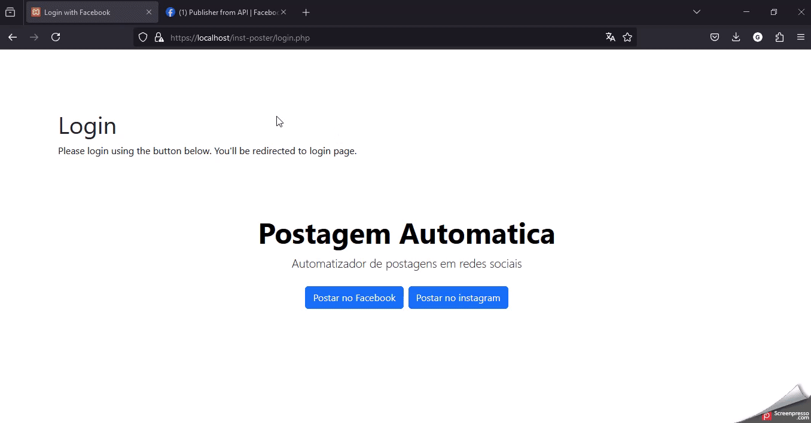

# A tool that uses GraphAPI from META to connect in a facebook page and publish content

This tool was build in pure PHP and uses the CURL library to do all the requests
To save and generates the URL's of the media to be published was used the AWS services.
the publications and logins is save in a Mysql database, all the scripts needed to create the tables is in the "setupEnviorment" folder.

## working tool

## Use of the tool 
The tool was designed to be an API that was incorporated to a WebShop system, this way the shop owner could create a content publish directly from their systems.

## Instagram 
The first version of the app was build to post and a instagram account that was linked in a enterprise page on facebook, a while later of the creation of the program the Meta implemented a method to do login directly in a Instagram account. 
That's why there two methods of login in this app.
